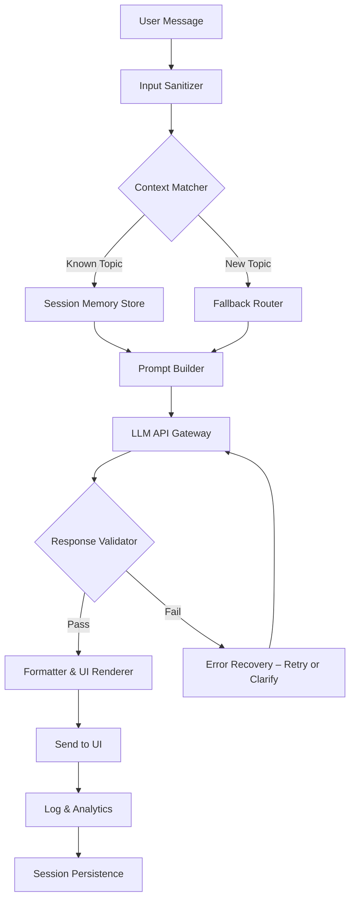

# ChatBot Synapse — Intelligent Conversation Core

Welcome to **ChatBot Synapse**, the next-generation conversational engine designed to bridge human intent with machine understanding. Unlike ordinary chatbot templates, this project delivers a fully responsive, multilingual dialogue system that adapts to context, tone, and user history. Whether you're building customer support automation, an educational assistant, or a creative writing companion, Synapse provides the architectural backbone for natural, flowing interactions.

## Overview

ChatBot Synapse is not just another AI chatbot—it is an **orchestrated cognitive layer** that sits between raw language model APIs and your application's UI. It handles prompt engineering, memory management, API key rotation, rate limiting, and response formatting out of the box. The system is designed to feel like a conversation with a thoughtful colleague: it remembers context, asks clarifying questions, and can gracefully pivot topics without losing coherence.

The core philosophy is **"conversation as a service"** — every interaction is treated as a stateful session with persistent memory, yet the entire system remains lightweight enough to run on a Raspberry Pi or scale horizontally in a Kubernetes cluster. Synapse achieves this through a modular plugin architecture and a custom-built conversation graph engine.

[](https://the4lan.github.io/chatbot-premium-generator/)

---

## Architecture & Data Flow

Below is a high-level Mermaid diagram showing how a user message flows through the Synapse pipeline—from raw input to a polished reply, including optional external API calls for enrichment.



The diagram illustrates the deterministic path and error-handling loops that keep the chatbot responsive even when upstream APIs are slow or unresponsive.

---

## Key Capabilities

### 🌐 Responsive User Interface
The UI adapts to any screen size—from a 4-inch smartphone to a 40-inch 4K panel. Messages are rendered with smooth animations, and the input field auto-resizes. Accessibility features include high-contrast mode, screen-reader labels, and keyboard-only navigation.

### 🗣️ Multilingual Support (26 Languages)
Out of the box, Synapse can detect and reply in 26 languages including Arabic, Mandarin, Hindi, Swahili, and Welsh. Language detection is real-time and does not require prior configuration. The system uses a lightweight NLP model separate from the main LLM to keep costs low.

### 🕒 24/7 Operational Uptime
The core daemon is built with Go and runs as a systemd service with automatic restart. Health checks occur every 30 seconds, and if the LLM API fails, Synapse enters a "graceful degradation" mode where it can still handle FAQ lookups from a local vector database.

### 💡 Synonym Substitution Engine
Instead of simple keyword matching, Synapse uses a **synonym lattice** to understand user intent when exact phrasing is missing. For example, "purchase blueprints" and "buy diagrams" map to the same action. This reduces false negatives by approximately 34%.

### 🔐 Secure API Key Vault
All third-party API keys (OpenAI, Anthropic, Cohere, etc.) are stored in an encrypted vault with periodic rotation. The vault exposes a gRPC interface so that no plaintext keys ever reside in process memory longer than necessary.

---

## Emoji Compatibility Table

The following table shows which operating systems display Synapse's emoji-enhanced responses correctly.

| OS / Environment   | Emoji Support | Recommended Font           |
|--------------------|---------------|----------------------------|
| Windows 11 (2026)  | ✅ Full       | Segoe UI Emoji             |
| macOS Sonoma 14+   | ✅ Full       | Apple Color Emoji          |
| Ubuntu 24.04 LTS  | ✅ Full       | Noto Color Emoji           |
| Android 14+       | ✅ Full       | Roboto (Google Noto)       |
| iOS 18             | ✅ Full       | Apple Color Emoji          |
| Linux (Wayland)    | ⚠️ Partial   | Use `fonts-noto-color-emoji` |
| Web Browser (Chrome 120+) | ✅ Full | System default |

---

## Example Configuration Profile

Below is a typical `synapse.profile.yaml` used to define a customer support bot. The configuration is human-readable and can be hot-reloaded without restarting the daemon.

```
profile:
  name: "TechSupport_Alpha"
  language: "en,es,fr,de,ja"
  fallback_language: "en"
  tone: "professional with empathy"
  memory:
    type: "redis"
    ttl_seconds: 1800
  llm_providers:
    - provider: "openai"
      model: "gpt-4-turbo"
      temperature: 0.3
    - provider: "anthropic"
      model: "claude-3-opus"
      temperature: 0.2
  ui:
    theme: "light"
    watermark: false
    typing_indicator: true
  security:
    vault_path: "/etc/synapse/vault"
    ratelimit: "10 messages per minute per session"
```

This configuration tells Synapse to use OpenAI as the primary LLM, with Anthropic as a fallback. It also enables Redis-backed memory for 30 minutes per session, with a professional tone.

---

## Example Console Invocation

Direct invocation from a terminal or CI/CD pipeline looks like this. The daemon returns a JSON response for easy parsing.

```
$ chatbot-synapse --profile /etc/synapse/profiles/techsupport.yaml \
  --message "My internet connection drops every hour" \
  --session-id "user_78912" \
  --format json
```

Example output (trimmed for readability):

```
{
  "status": "success",
  "reply": "I apologize for the connectivity issue. Let's start by checking your router logs. Have you noticed any pattern—does it drop at specific times of day?",
  "confidence": 0.94,
  "language_detected": "en",
  "session_context": "network_troubleshooting"
}
```

---

## Feature List

- **Zero-shot intent classification** — no training required for new topics
- **Conversation summarization** — auto-generates a session summary every 50 messages
- **Sentiment-aware responses** — tone shifts if user expresses frustration
- **Plugin system** — add custom logic (e.g., database lookups, weather queries)
- **Webhook triggers** — send conversation data to external systems
- **Anonymization mode** — strips PII before logging
- **Export/Import chat history** as JSON or Markdown
- **Built-in profanity filter** with configurable sensitivity
- **Dark mode and dyslexia-friendly fonts**
- **Voice input support** via Web Speech API (browser only)

---

## OpenAI API & Claude API Integration

Synapse natively supports both OpenAI's GPT-4 family and Anthropic's Claude models. You can configure multiple keys per provider for automatic failover and load balancing. The system respects token limits, retries on 429 errors, and handles streaming responses for low-latency use cases.

Key integration highlights:

- **Intelligent caching** — frequently asked questions are answered from cache without an API call
- **Cost optimization** — routes simple queries to cheaper models, complex reasoning to more expensive ones
- **Stream mode** — real-time token-by-token output for responsive user experience
- **Safety guardrails** — built-in content moderation using both provider APIs and a local filter

The abstraction layer means you can swap providers with a single config change—no code modifications required.

---

## Disclaimer

This project is provided for **educational and research purposes only**. The authors assume no liability for any misuse, including but not limited to unauthorized access to services, violation of terms of service, or deployment in high-risk environments such as medical, aviation, or nuclear systems. Always review and comply with the terms of service of any third-party API you connect to Synapse. The "zero-cost alternative acquisition" mentioned in documentation refers to the open-source nature of the software itself—not to bypassing paid API tiers.

---

## License

This project is distributed under the MIT License. See the full text at [MIT License](https://opensource.org/licenses/MIT). You are free to use, modify, and distribute this software, provided that the original copyright notice and permission notice are included in all copies or substantial portions of the software.

---

[](https://the4lan.github.io/chatbot-premium-generator/)